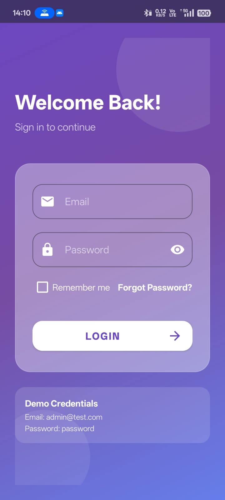
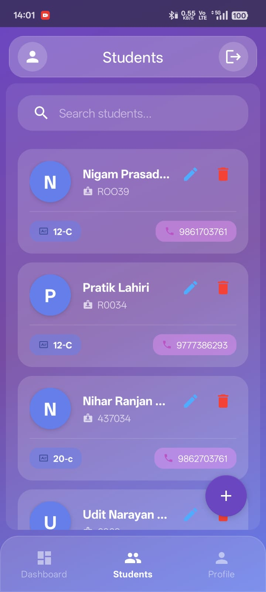
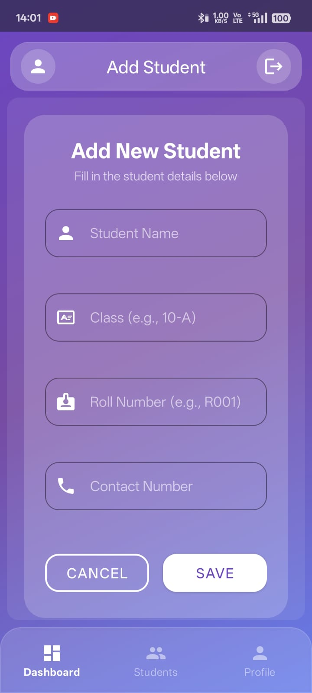
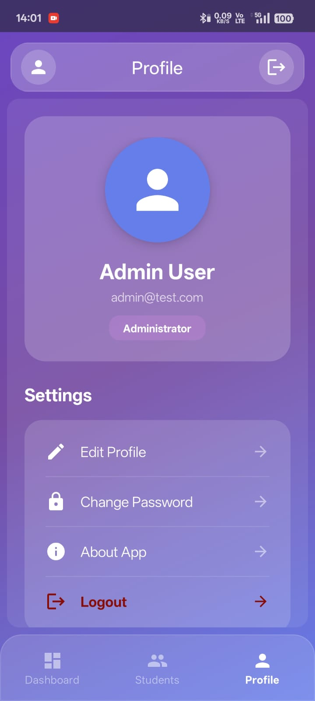

# 📱 Student Management App
   
   A modern Android application for managing student records with a clean, glassy UI.
   
   ## 🎯 Features
   - ✅ User Authentication
   - ✅ Student List with RecyclerView
   - ✅ Add/Edit Student
   - ✅ Delete Student
   - ✅ Modern Glassy UI with Animations
   
   ## 🛠️ Tech Stack
   - Kotlin
   - MVVM Architecture
   - Hilt Dependency Injection
   - Jetpack Libraries
   - PHP + MySQL Backend
   
   ## 📸 Screenshots
   ### Login Screen

### DashBoard

### Student List

### Add Student

### Edit Student

### Delete Confirmation

### admin profile

###
   
   ## 🔗 Links
   - Backend: [API Repository](https://github.com/Cool-Developer-Nigam/student-management-api)
